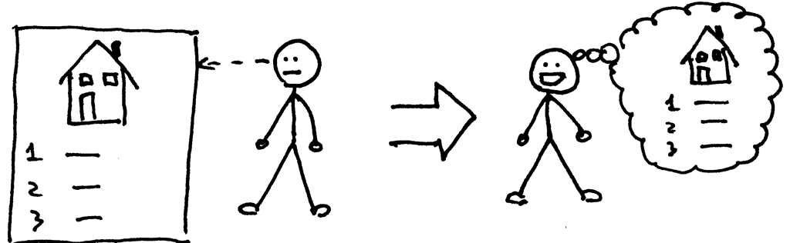
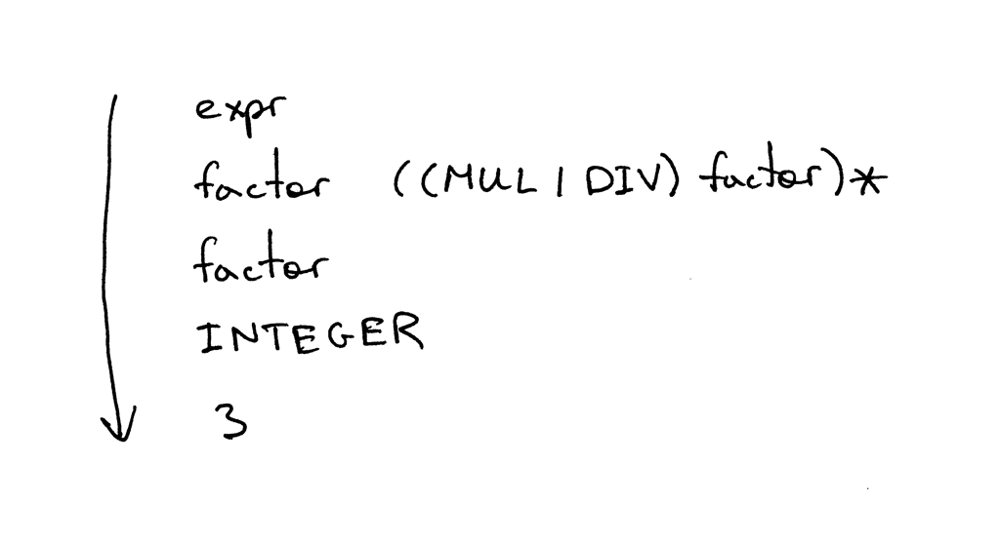

Have you been passively learning the material in these articles or have you been actively practicing it? I hope you’ve been actively practicing it. I really do :)

Remember what Confucius said?

> “I hear and I forget.”


> “I see and I remember.”



> “I do and I understand.”


In the previous article you learned how to parse (recognize) and interpret arithmetic expressions with any number of plus or minus operators in them, for example “7 - 3 + 2 - 1”. You also learned about syntax diagrams and how they can be used to specify the syntax of a programming language.

Today you’re going to learn how to parse and interpret arithmetic expressions with any number of multiplication and division operators in them, for example “7 * 4 / 2 * 3”. The division in this article will be an integer division, so if the expression is “9 / 4”, then the answer will be an integer: 2.

I will also talk quite a bit today about another widely used notation for specifying the syntax of a programming language. It’s called context-free grammars (grammars, for short) or BNF (Backus-Naur Form). For the purpose of this article I will not use pure BNF notation but more like a modified EBNF notation.

Here are a couple of reasons to use grammars:

1. A grammar specifies the syntax of a programming language in a concise manner. Unlike syntax diagrams, grammars are very compact. You will see me using grammars more and more in future articles.
2. A grammar can serve as great documentation.
3. A grammar is a good starting point even if you manually write your parser from scratch. Quite often you can just convert the grammar to code by following a set of simple rules.
4. There is a set of tools, called parser generators, which accept a grammar as an input and automatically generate a parser for you based on that grammar. I will talk about those tools later on in the series.

Now, let’s talk about the mechanical aspects of grammars, shall we?

Here is a grammar that describes arithmetic expressions like “7 * 4 / 2 * 3” (it’s just one of the many expressions that can be generated by the grammar):


A grammar consists of a sequence of rules, also known as productions. There are two rules in our grammar:


A rule consists of a non-terminal, called the head or left-hand side of the production, a colon, and a sequence of terminals and/or non-terminals, called the body or right-hand side of the production:


In the grammar I showed above, tokens like MUL, DIV, and INTEGER are called terminals and variables like expr and factor are called non-terminals. Non-terminals usually consist of a sequence of terminals and/or non-terminals:


The non-terminal symbol on the left side of the first rule is called the start symbol. In the case of our grammar, the start symbol is expr:


You can read the rule expr as “An expr can be a factor optionally followed by a multiplication or division operator followed by another factor, which in turn is optionally followed by a multiplication or division operator followed by another factor and so on and so forth.”

What is a factor? For the purpose of this article a factor is just an integer.

Let’s quickly go over the symbols used in the grammar and their meaning.

* | - Alternatives. A bar means “or”. So (MUL | DIV) means either MUL or DIV.
* ( … ) - An open and closing parentheses mean grouping of terminals and/or non-terminals as in (MUL | DIV).
* ( … )* - Match contents within the group zero or more times.

If you worked with regular expressions in the past, then the symbols |, (), and (…)* should be pretty familiar to you.

A grammar defines a language by explaining what sentences it can form. This is how you can derive an arithmetic expression using the grammar: first you begin with the start symbol expr and then repeatedly replace a non-terminal by the body of a rule for that non-terminal until you have generated a sentence consisting solely of terminals. Those sentences form a language defined by the grammar.

If the grammar cannot derive a certain arithmetic expression, then it doesn’t support that expression and the parser will generate a syntax error when it tries to recognize the expression.

I think a couple of examples are in order. This is how the grammar derives the expression 3:



This is how the grammar derives the expression 3 * 7:


And this is how the grammar derives the expression 3 * 7 / 2:


Whoa, quite a bit of theory right there!

I think when I first read about grammars, the related terminology, and all that jazz, I felt something like this:


I can assure you that I definitely was not like this:


It took me some time to get comfortable with the notation, how it works, and its relationship with parsers and lexers, but I have to tell you that it pays to learn it in the long run because it’s so widely used in practice and compiler literature that you’re bound to run into it at some point. So, why not sooner rather than later? :)

Now, let’s map that grammar to code, okay?

Here are the guidelines that we will use to convert the grammar to source code. By following them, you can literally translate the grammar to a working parser:

1. Each rule, R, defined in the grammar, becomes a method with the same name, and references to that rule become a method call: R(). The body of the method follows the flow of the body of the rule using the very same guidelines.
2. Alternatives (a1 | a2 | aN) become an if-elif-else statement
3. An optional grouping (…)* becomes a while statement that can loop over zero or more times
4. Each token reference T becomes a call to the method eat: eat(T). The way the eat method works is that it consumes the token T if it matches the current lookahead token, then it gets a new token from the lexer and assigns that token to the current_token internal variable.

Visually the guidelines look like this:


Let’s get moving and convert our grammar to code following the above guidelines.

There are two rules in our grammar: one expr rule and one factor rule. Let’s start with the factor rule (production). According to the guidelines, you need to create a method called factor (guideline 1) that has a single call to the eat method to consume the INTEGER token (guideline 4):

```python
def factor(self):
    self.eat(INTEGER)
```

That was easy, wasn’t it?

Onward!

The rule expr becomes the expr method (again according to the guideline 1). The body of the rule starts with a reference to factor that becomes a factor() method call. The optional grouping (…)* becomes a while loop and (MUL | DIV) alternatives become an if-elif-else statement. By combining those pieces together we get the following expr method:

```python
def expr(self):
    self.factor()

    while self.current_token.type in (MUL, DIV):
        token = self.current_token
        if token.type == MUL:
            self.eat(MUL)
            self.factor()
        elif token.type == DIV:
            self.eat(DIV)
            self.factor()
```

Please spend some time and study how I mapped the grammar to the source code. Make sure you understand that part because it’ll come in handy later on.

For your convenience I put the above code into the parser.py file that contains a lexer and a parser without an interpreter. You can download the file directly from GitHub and play with it. It has an interactive prompt where you can enter expressions and see if they are valid: that is, if the parser built according to the grammar can recognize the expressions.

Here is a sample session that I ran on my computer:

```python
$ python parser.py
calc> 3
calc> 3 * 7
calc> 3 * 7 / 2
calc> 3 *
Traceback (most recent call last):
  File "parser.py", line 155, in <module>
    main()
  File "parser.py", line 151, in main
    parser.parse()
  File "parser.py", line 136, in parse
    self.expr()
  File "parser.py", line 130, in expr
    self.factor()
  File "parser.py", line 114, in factor
    self.eat(INTEGER)
  File "parser.py", line 107, in eat
    self.error()
  File "parser.py", line 97, in error
    raise Exception('Invalid syntax')
Exception: Invalid syntax
```

Try it out!

I couldn’t help but mention syntax diagrams again. This is how a syntax diagram for the same expr rule will look:


It’s about time we dug into the source code of our new arithmetic expression interpreter. Below is the code of a calculator that can handle valid arithmetic expressions containing integers and any number of multiplication and division (integer division) operators. You can also see that I refactored the lexical analyzer into a separate class Lexer and updated the Interpreter class to take the Lexer instance as a parameter:

```python
# Token types
#
# EOF (end-of-file) token is used to indicate that
# there is no more input left for lexical analysis
INTEGER, MUL, DIV, EOF = 'INTEGER', 'MUL', 'DIV', 'EOF'


class Token(object):
    def __init__(self, type, value):
        # token type: INTEGER, MUL, DIV, or EOF
        self.type = type
        # token value: non-negative integer value, '*', '/', or None
        self.value = value

    def __str__(self):
        """String representation of the class instance.

        Examples:
            Token(INTEGER, 3)
            Token(MUL, '*')
        """
        return 'Token({type}, {value})'.format(
            type=self.type,
            value=repr(self.value)
        )

    def __repr__(self):
        return self.__str__()


class Lexer(object):
    def __init__(self, text):
        # client string input, e.g. "3 * 5", "12 / 3 * 4", etc
        self.text = text
        # self.pos is an index into self.text
        self.pos = 0
        self.current_char = self.text[self.pos]

    def error(self):
        raise Exception('Invalid character')

    def advance(self):
        """Advance the `pos` pointer and set the `current_char` variable."""
        self.pos += 1
        if self.pos > len(self.text) - 1:
            self.current_char = None  # Indicates end of input
        else:
            self.current_char = self.text[self.pos]

    def skip_whitespace(self):
        while self.current_char is not None and self.current_char.isspace():
            self.advance()

    def integer(self):
        """Return a (multidigit) integer consumed from the input."""
        result = ''
        while self.current_char is not None and self.current_char.isdigit():
            result += self.current_char
            self.advance()
        return int(result)

    def get_next_token(self):
        """Lexical analyzer (also known as scanner or tokenizer)

        This method is responsible for breaking a sentence
        apart into tokens. One token at a time.
        """
        while self.current_char is not None:

            if self.current_char.isspace():
                self.skip_whitespace()
                continue

            if self.current_char.isdigit():
                return Token(INTEGER, self.integer())

            if self.current_char == '*':
                self.advance()
                return Token(MUL, '*')

            if self.current_char == '/':
                self.advance()
                return Token(DIV, '/')

            self.error()

        return Token(EOF, None)


class Interpreter(object):
    def __init__(self, lexer):
        self.lexer = lexer
        # set current token to the first token taken from the input
        self.current_token = self.lexer.get_next_token()

    def error(self):
        raise Exception('Invalid syntax')

    def eat(self, token_type):
        # compare the current token type with the passed token
        # type and if they match then "eat" the current token
        # and assign the next token to the self.current_token,
        # otherwise raise an exception.
        if self.current_token.type == token_type:
            self.current_token = self.lexer.get_next_token()
        else:
            self.error()

    def factor(self):
        """Return an INTEGER token value.

        factor : INTEGER
        """
        token = self.current_token
        self.eat(INTEGER)
        return token.value

    def expr(self):
        """Arithmetic expression parser / interpreter.

        expr   : factor ((MUL | DIV) factor)*
        factor : INTEGER
        """
        result = self.factor()

        while self.current_token.type in (MUL, DIV):
            token = self.current_token
            if token.type == MUL:
                self.eat(MUL)
                result = result * self.factor()
            elif token.type == DIV:
                self.eat(DIV)
                result = result / self.factor()

        return result


def main():
    while True:
        try:
            # To run under Python3 replace 'raw_input' call
            # with 'input'
            text = raw_input('calc> ')
        except EOFError:
            break
        if not text:
            continue
        lexer = Lexer(text)
        interpreter = Interpreter(lexer)
        result = interpreter.expr()
        print(result)


if __name__ == '__main__':
    main()
```

Save the above code into the calc4.py file or download it directly from GitHub. As usual, try it out and see for yourself that it works.

将上面的代码保存到calc4.py文件中，或者直接从GitHub下载。和往常一样，试一试，自己看看能不能用。

This is a sample session that I ran on my laptop:

这是我在我的笔记本电脑上运行的一个示例会话。

```python
$ python calc4.py
calc> 7 * 4 / 2
14
calc> 7 * 4 / 2 * 3
42
calc> 10 * 4  * 2 * 3 / 8
30
```

I know you couldn’t wait for this part :) Here are new exercises for today:


* Write a grammar that describes arithmetic expressions containing any number of +, -, *, or / operators. With the grammar you should be able to derive expressions like “2 + 7 * 4”, “7 - 8 / 4”, “14 + 2 * 3 - 6 / 2”, and so on.
* Using the grammar, write an interpreter that can evaluate arithmetic expressions containing any number of +, -, *, or / operators. Your interpreter should be able to handle expressions like “2 + 7 * 4”, “7 - 8 / 4”, “14 + 2 * 3 - 6 / 2”, and so on.
* If you’ve finished the above exercises, relax and enjoy :)

Check your understanding.

Keeping in mind the grammar from today’s article, answer the following questions, referring to the picture below as needed:


1. What is a context-free grammar (grammar)?

什么是上下文无关文法（grammar）？

2. How many rules / productions does the grammar have?

3. What is a terminal? (Identify all terminals in the picture)

4. What is a non-terminal? (Identify all non-terminals in the picture)

5. What is a head of a rule? (Identify all heads / left-hand sides in the picture)

6. What is a body of the rule? (Identify all bodies / right-hand sides in the picture)

7. What is the start symbol of a grammar?

Hey, you read all the way to the end! This post contained quite a bit of theory, so I’m really proud of you that you finished it.

嘿，你都读到最后了! 这篇文章包含了不少理论，所以我真的很为你感到骄傲，你完成了它。

I’ll be back next time with a new article - stay tuned and don’t forget to do the exercises, they will do you good.

下一次我会带着新的文章回来--敬请期待，别忘了做练习，它们会对你有好处。

Here is a list of books I recommend that will help you in your study of interpreters and compilers:

下面是我推荐的书单，对你学习解释器和编译器会有所帮助。

1. [Language Implementation Patterns: Create Your Own Domain-Specific and General Programming Languages (Pragmatic Programmers)](https://www.amazon.com/gp/product/193435645X/ref=as_li_tl?ie=UTF8&camp=1789&creative=9325&creativeASIN=193435645X&linkCode=as2&tag=russblo0b-20&linkId=MP4DCXDV6DJMEJBL)
2. [Writing Compilers and Interpreters: A Software Engineering Approach](https://www.amazon.com/gp/product/0470177071/ref=as_li_tl?ie=UTF8&camp=1789&creative=9325&creativeASIN=0470177071&linkCode=as2&tag=russblo0b-20&linkId=UCLGQTPIYSWYKRRM)
3. [Modern Compiler Implementation in Java](https://www.amazon.com/gp/product/052182060X/ref=as_li_tl?ie=UTF8&camp=1789&creative=9325&creativeASIN=052182060X&linkCode=as2&tag=russblo0b-20&linkId=ZSKKZMV7YWR22NMW)
4. [Modern Compiler Design](https://www.amazon.com/gp/product/1461446988/ref=as_li_tl?ie=UTF8&camp=1789&creative=9325&creativeASIN=1461446988&linkCode=as2&tag=russblo0b-20&linkId=PAXWJP5WCPZ7RKRD)
5. [Compilers: Principles, Techniques, and Tools (2nd Edition)](https://www.amazon.com/gp/product/0321486811/ref=as_li_tl?ie=UTF8&camp=1789&creative=9325&creativeASIN=0321486811&linkCode=as2&tag=russblo0b-20&linkId=GOEGDQG4HIHU56FQ)
