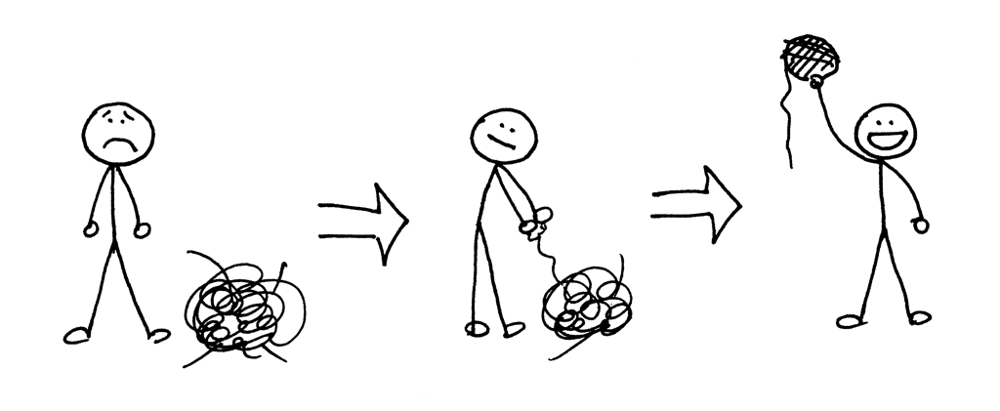
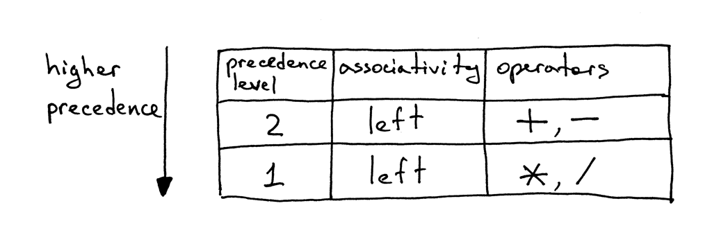
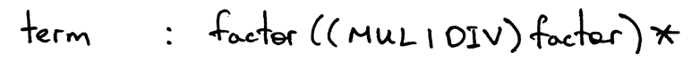
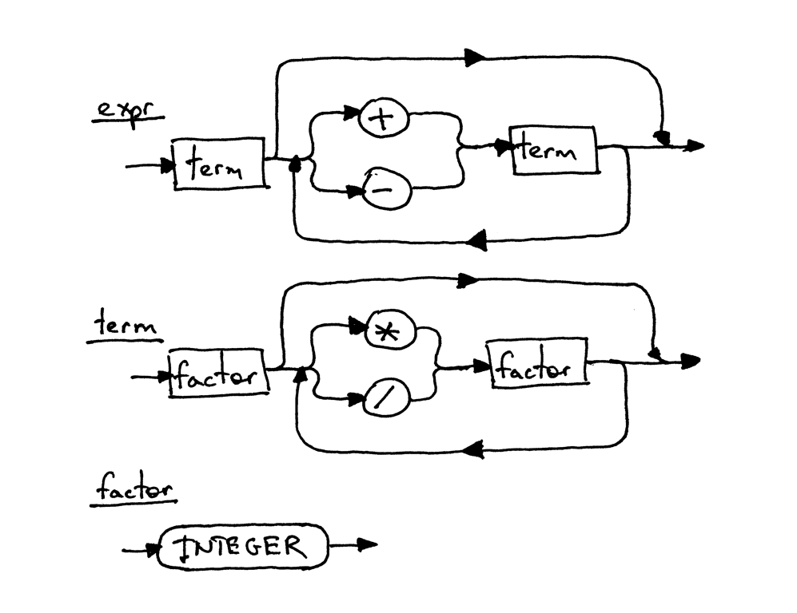
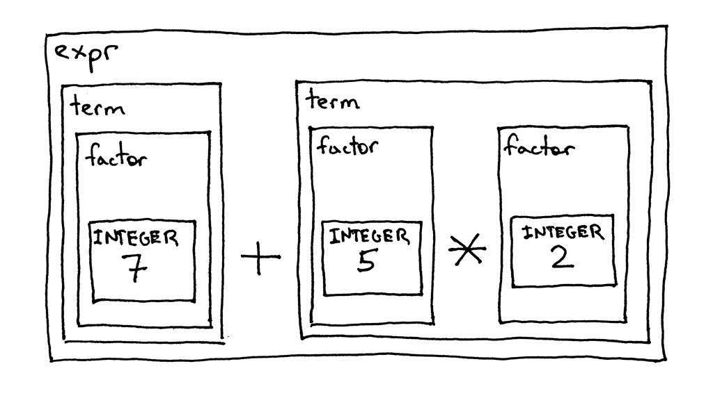

# Let’s Build A Simple Interpreter. Part 5.

How do you tackle something as complex as understanding how to create an interpreter or compiler? In the beginning it all looks pretty much like a tangled mess of yarn that you need to untangle to get that perfect ball.

The way to get there is to just untangle it one thread, one knot at a time. Sometimes, though, you might feel like you don’t understand something right away, but you have to keep going. It will eventually “click” if you’re persistent enough, I promise you (Gee, if I put aside 25 cents every time I didn’t understand something right away I would have become rich a long time ago :).

Probably one of the best pieces of advice I could give you on your way to understanding how to create an interpreter and compiler is to read the explanations in the articles, read the code, and then write code yourself, and even write the same code several times over a period of time to make the material and code feel natural to you, and only then move on to learn new topics. Do not rush, just slow down and take your time to understand the basic ideas deeply. This approach, while seemingly slow, will pay off down the road. Trust me.

You will eventually get your perfect ball of yarn in the end. And, you know what? Even if it is not that perfect it is still better than the alternative, which is to do nothing and not learn the topic or quickly skim over it and forget it in a couple of days.

Remember - just keep untangling: one thread, one knot at a time and practice what you’ve learned by writing code, a lot of it:



Today you’re going to use all the knowledge you’ve gained from previous articles in the series and learn how to parse and interpret arithmetic expressions that have any number of addition, subtraction, multiplication, and division operators. You will write an interpreter that will be able to evaluate expressions like “14 + 2 * 3 - 6 / 2”.

Before diving in and writing some code let’s talk about the associativity and precedence of operators.

By convention 7 + 3 + 1 is the same as (7 + 3) + 1 and 7 - 3 - 1 is equivalent to (7 - 3) - 1. No surprises here. We all learned that at some point and have been taking it for granted since then. If we treated 7 - 3 - 1 as 7 - (3 - 1) the result would be unexpected 5 instead of the expected 3.

In ordinary arithmetic and most programming languages addition, subtraction, multiplication, and division are left-associative:

```python
7 + 3 + 1 is equivalent to (7 + 3) + 1
7 - 3 - 1 is equivalent to (7 - 3) - 1
8 * 4 * 2 is equivalent to (8 * 4) * 2
8 / 4 / 2 is equivalent to (8 / 4) / 2
```

What does it mean for an operator to be left-associative?

When an operand like 3 in the expression 7 + 3 + 1 has plus signs on both sides, we need a convention to decide which operator applies to 3. Is it the one to the left or the one to the right of the operand 3? The operator + associates to the left because an operand that has plus signs on both sides belongs to the operator to its left and so we say that the operator + is left-associative. That’s why 7 + 3 + 1 is equivalent to (7 + 3) + 1 by the associativity convention.

Okay, what about an expression like 7 + 5 * 2 where we have different kinds of operators on both sides of the operand 5? Is the expression equivalent to 7 + (5 * 2) or (7 + 5) * 2? How do we resolve this ambiguity?

In this case, the associativity convention is of no help to us because it applies only to operators of one kind, either additive (+, -) or multiplicative (*, /). We need another convention to resolve the ambiguity when we have different kinds of operators in the same expression. We need a convention that defines relative precedence of operators.

And here it is: we say that if the operator * takes its operands before + does, then it has higher precedence. In the arithmetic that we know and use, multiplication and division have higher precedence than addition and subtraction. As a result the expression 7 + 5 * 2 is equivalent to 7 + (5 * 2) and the expression 7 - 8 / 4 is equivalent to 7 - (8 / 4).

In a case where we have an expression with operators that have the same precedence, we just use the associativity convention and execute the operators from left to right:

```python
7 + 3 - 1 is equivalent to (7 + 3) - 1
8 / 4 * 2 is equivalent to (8 / 4) * 2
```

I hope you didn’t think I wanted to bore you to death by talking so much about the associativity and precedence of operators. The nice thing about those conventions is that we can construct a grammar for arithmetic expressions from a table that shows the associativity and precedence of arithmetic operators. Then, we can translate the grammar into code by following the guidelines I outlined in Part 4, and our interpreter will be able to handle the precedence of operators in addition to associativity.

Okay, here is our precedence table:



From the table, you can tell that operators + and - have the same precedence level and they are both left-associative. You can also see that operators * and / are also left-associative, have the same precedence among themselves but have higher-precedence than addition and subtraction operators.

Here are the rules for how to construct a grammar from the precedence table:

For each level of precedence define a non-terminal. The body of a production for the non-terminal should contain arithmetic operators from that level and non-terminals for the next higher level of precedence.
Create an additional non-terminal factor for basic units of expression, in our case, integers. The general rule is that if you have N levels of precedence, you will need N + 1 non-terminals in total: one non-terminal for each level plus one non-terminal for basic units of expression.
Onward!

Let’s follow the rules and construct our grammar.

According to Rule 1 we will define two non-terminals: a non-terminal called expr for level 2 and a non-terminal called term for level 1. And by following Rule 2 we will define a factor non-terminal for basic units of arithmetic expressions, integers.

The start symbol of our new grammar will be expr and the expr production will contain a body representing the use of operators from level 2, which in our case are operators + and - , and will contain term non-terminals for the next higher level of precedence, level 1:


The term production will have a body representing the use of operators from level 1, which are operators * and / , and it will contain the non-terminal factor for the basic units of expression, integers:



And the production for the non-terminal factor will be:


You’ve already seen above productions as part of grammars and syntax diagrams from previous articles, but here we combine them into one grammar that takes care of the associativity and the precedence of operators:


Here is a syntax diagram that corresponds to the grammar above:



Each rectangular box in the diagram is a “method call” to another diagram. If you take the expression 7 + 5 * 2 and start with the top diagram expr and walk your way down to the bottommost diagram factor, you should be able to see that higher-precedence operators * and / in the lower diagram execute before operators + and - in the higher diagram.

图中的每个矩形框都是对另一个图的 "方法调用"。如果你把表达式7 + 5 * 2从最上面的图 expr 开始，一直走到最下面的图因子，你应该能够看到，下图中的高位运算符*和/在上图中的运算符+和-之前执行。

To drive the precedence of operators point home, let’s take a look at the decomposition of the same arithmetic expression 7 + 5 * 2 done in accordance with our grammar and syntax diagrams above. This is just another way to show that higher-precedence operators execute before operators with lower precedence:

为了说明运算符的优先级，我们来看看按照我们上面的语法和句法图所做的同一个算术表达式7 + 5 * 2的分解。这只是另一种方式来说明优先级较高的运算符在优先级较低的运算符之前执行。



Okay, let’s convert the grammar to code following guidelines from Part 4 and see how our new interpreter works, shall we?

好了，让我们按照第4部分的指南将语法转换为代码，看看我们的新解释器如何工作，好吗？

Here is the grammar again:

这里又是语法：


And here is the complete code of a calculator that can handle valid arithmetic expressions containing integers and any number of addition, subtraction, multiplication, and division operators.

而这里是一个计算器的完整代码，它可以处理包含整数和任何数量的加减乘除运算符的有效算术表达式。

The following are the main changes compared with the code from Part 4:

与第四部分的代码相比，主要变化如下:

* The Lexer class can now tokenize +, -, *, and / (Nothing new here, we just combined code from previous articles into one class that supports all those tokens)
* Recall that each rule (production), R, defined in the grammar, becomes a method with the same name, and references to that rule become a method call: R(). As a result the Interpreter class now has three methods that correspond to non-terminals in the grammar: expr, term, and factor.

Source code:

源代码：

```python
# Token types
#
# EOF (end-of-file) token is used to indicate that
# there is no more input left for lexical analysis
INTEGER, PLUS, MINUS, MUL, DIV, EOF = (
    'INTEGER', 'PLUS', 'MINUS', 'MUL', 'DIV', 'EOF'
)


class Token(object):
    def __init__(self, type, value):
        # token type: INTEGER, PLUS, MINUS, MUL, DIV, or EOF
        self.type = type
        # token value: non-negative integer value, '+', '-', '*', '/', or None
        self.value = value

    def __str__(self):
        """String representation of the class instance.

        Examples:
            Token(INTEGER, 3)
            Token(PLUS, '+')
            Token(MUL, '*')
        """
        return 'Token({type}, {value})'.format(
            type=self.type,
            value=repr(self.value)
        )

    def __repr__(self):
        return self.__str__()


class Lexer(object):
    def __init__(self, text):
        # client string input, e.g. "3 * 5", "12 / 3 * 4", etc
        self.text = text
        # self.pos is an index into self.text
        self.pos = 0
        self.current_char = self.text[self.pos]

    def error(self):
        raise Exception('Invalid character')

    def advance(self):
        """Advance the `pos` pointer and set the `current_char` variable."""
        self.pos += 1
        if self.pos > len(self.text) - 1:
            self.current_char = None  # Indicates end of input
        else:
            self.current_char = self.text[self.pos]

    def skip_whitespace(self):
        while self.current_char is not None and self.current_char.isspace():
            self.advance()

    def integer(self):
        """Return a (multidigit) integer consumed from the input."""
        result = ''
        while self.current_char is not None and self.current_char.isdigit():
            result += self.current_char
            self.advance()
        return int(result)

    def get_next_token(self):
        """Lexical analyzer (also known as scanner or tokenizer)

        This method is responsible for breaking a sentence
        apart into tokens. One token at a time.
        """
        while self.current_char is not None:

            if self.current_char.isspace():
                self.skip_whitespace()
                continue

            if self.current_char.isdigit():
                return Token(INTEGER, self.integer())

            if self.current_char == '+':
                self.advance()
                return Token(PLUS, '+')

            if self.current_char == '-':
                self.advance()
                return Token(MINUS, '-')

            if self.current_char == '*':
                self.advance()
                return Token(MUL, '*')

            if self.current_char == '/':
                self.advance()
                return Token(DIV, '/')

            self.error()

        return Token(EOF, None)


class Interpreter(object):
    def __init__(self, lexer):
        self.lexer = lexer
        # set current token to the first token taken from the input
        self.current_token = self.lexer.get_next_token()

    def error(self):
        raise Exception('Invalid syntax')

    def eat(self, token_type):
        # compare the current token type with the passed token
        # type and if they match then "eat" the current token
        # and assign the next token to the self.current_token,
        # otherwise raise an exception.
        if self.current_token.type == token_type:
            self.current_token = self.lexer.get_next_token()
        else:
            self.error()

    def factor(self):
        """factor : INTEGER"""
        token = self.current_token
        self.eat(INTEGER)
        return token.value

    def term(self):
        """term : factor ((MUL | DIV) factor)*"""
        result = self.factor()

        while self.current_token.type in (MUL, DIV):
            token = self.current_token
            if token.type == MUL:
                self.eat(MUL)
                result = result * self.factor()
            elif token.type == DIV:
                self.eat(DIV)
                result = result / self.factor()

        return result

    def expr(self):
        """Arithmetic expression parser / interpreter.

        calc>  14 + 2 * 3 - 6 / 2
        17

        expr   : term ((PLUS | MINUS) term)*
        term   : factor ((MUL | DIV) factor)*
        factor : INTEGER
        """
        result = self.term()

        while self.current_token.type in (PLUS, MINUS):
            token = self.current_token
            if token.type == PLUS:
                self.eat(PLUS)
                result = result + self.term()
            elif token.type == MINUS:
                self.eat(MINUS)
                result = result - self.term()

        return result


def main():
    while True:
        try:
            # To run under Python3 replace 'raw_input' call
            # with 'input'
            text = raw_input('calc> ')
        except EOFError:
            break
        if not text:
            continue
        lexer = Lexer(text)
        interpreter = Interpreter(lexer)
        result = interpreter.expr()
        print(result)


if __name__ == '__main__':
    main()
```

Save the above code into the calc5.py file or download it directly from GitHub. 
As usual, try it out and see for yourself that the interpreter properly evaluates 
arithmetic expressions that have operators with different precedence.

将上面的代码保存到 calc5.py 文件中，或者直接从 GitHub 上下载。
像往常一样，尝试一下，自己看看解释器是否能正确地评估具有不同优先级运算符的算术表达式。

Here is a sample session on my laptop:

这是我的笔记本电脑上的一个样本会话。

```python
$ python calc5.py
calc> 3
3
calc> 2 + 7 * 4
30
calc> 7 - 8 / 4
5
calc> 14 + 2 * 3 - 6 / 2
17
```

Here are new exercises for today:

下面是今天的新练习。

Write an interpreter as described in this article off the top of your head, without peeking into the code from the article. Write some tests for your interpreter, and make sure they pass.

在不偷看文章中的代码的情况下，按照这篇文章中描述的内容脱口而出，写一个解释器。为你的解释器写一些测试，并确保它们通过。

Extend the interpreter to handle arithmetic expressions containing parentheses so that your interpreter could evaluate deeply nested arithmetic expressions like: 7 + 3 * (10 / (12 / (3 + 1) - 1))

扩展解释器以处理包含小括号的算术表达式，这样您的解释器就可以评估深嵌套的算术表达式，如：7 + 3 * (10 / (12 / (3 + 1) - 1))。7 + 3 * (10 / (12 / (3 + 1) - 1))

Check your understanding.

检查你的理解。

What does it mean for an operator to be left-associative?

运算符的左联是什么意思？

Are operators + and - left-associative or right-associative? What about * and / ?

运算符+和-是左关联的还是右关联的？那*和/呢？

Does operator + have higher precedence than operator * ?

运算符 + 比运算符 * 有更高的优先权吗？

Hey, you read all the way to the end! That’s really great. I’ll be back next time with a new article - stay tuned, be brilliant, and, as usual, don’t forget to do the exercises.

嘿，你都读到最后了! 那真是太好了。下一次我会带着新的文章回来--敬请期待，要有出色的表现，而且，和往常一样，别忘了做练习。

Here is a list of books I recommend that will help you in your study of interpreters and compilers:

下面是我推荐的书单，对你学习解释器和编译器会有所帮助。

1. [Language Implementation Patterns: Create Your Own Domain-Specific and General Programming Languages (Pragmatic Programmers)](https://www.amazon.com/gp/product/193435645X/ref=as_li_tl?ie=UTF8&camp=1789&creative=9325&creativeASIN=193435645X&linkCode=as2&tag=russblo0b-20&linkId=MP4DCXDV6DJMEJBL)
2. [Writing Compilers and Interpreters: A Software Engineering Approach](https://www.amazon.com/gp/product/0470177071/ref=as_li_tl?ie=UTF8&camp=1789&creative=9325&creativeASIN=0470177071&linkCode=as2&tag=russblo0b-20&linkId=UCLGQTPIYSWYKRRM)
3. [Modern Compiler Implementation in Java](https://www.amazon.com/gp/product/052182060X/ref=as_li_tl?ie=UTF8&camp=1789&creative=9325&creativeASIN=052182060X&linkCode=as2&tag=russblo0b-20&linkId=ZSKKZMV7YWR22NMW)
4. [Modern Compiler Design](https://www.amazon.com/gp/product/1461446988/ref=as_li_tl?ie=UTF8&camp=1789&creative=9325&creativeASIN=1461446988&linkCode=as2&tag=russblo0b-20&linkId=PAXWJP5WCPZ7RKRD)
5. [Compilers: Principles, Techniques, and Tools (2nd Edition)](https://www.amazon.com/gp/product/0321486811/ref=as_li_tl?ie=UTF8&camp=1789&creative=9325&creativeASIN=0321486811&linkCode=as2&tag=russblo0b-20&linkId=GOEGDQG4HIHU56FQ)
